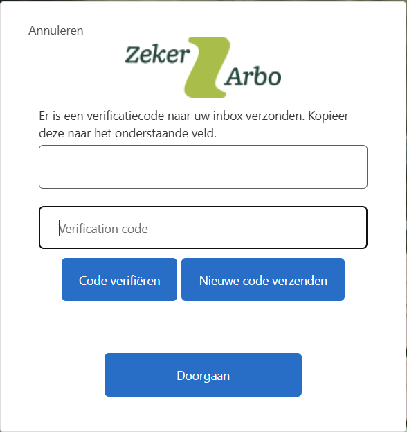

# Werkwijze problemen inloggen - Klantgebruiker (werkgever/leidinggevende)

Deze werkwijze is onderdeel van **First Time Fix**. Het doel is: de klant in één keer helpen.

Gebruik dit bij:

* Inlogproblemen in het (werkgevers) klantportaal
* Geen medewerkers / documenten zichtbaar



### Klantmelding

De klant belt of mailt met een vraag of probleem over inloggen op het (werkgevers) klantportaal.



### Gegevens uitvragen

Vraag met welk e-mailadres de klant probeert in te loggen en doe een verificatie om de identiteit van de klant te controleren.


[Werkwijze klant verifiëren](werkwijze-klant-verifieren.md)




### Account opzoeken

Ga naar **Planningsagenda → Klant gebruikers**.

Zoek het account op via het e-mailadres.



### Bestaat het account?

* **Ja** → ga door bij [Account bestaat](werkwijze-problemen-inloggen-klantgebruiker-werkgever-leidinggevende.md#account-bestaat-controle-gegevens).
* **Nee** → ga door bij [Account niet gevonden](werkwijze-problemen-inloggen-klantgebruiker-werkgever-leidinggevende.md#account-niet-gevonden).



## Account bestaat - Controle gegevens



### Standaard vragen

Om welk probleem gaat het?

* **Wachtwoord werkt niet / inlogfout** → ga door naar de volgende stap
* **2FA werkt niet** → ga door naar [2FA problemen](werkwijze-problemen-inloggen-klantgebruiker-werkgever-leidinggevende.md#2fa-problemen)
* **Geen medewerkers zichtbaar** → ga door naar [Geen medewerkers zichtbaar](werkwijze-problemen-inloggen-klantgebruiker-werkgever-leidinggevende.md#geen-medewerkers-zichtbaar)



### Gebruiker openen

Open de opgezochte gebruiker in Planningsagenda door erop te klikken, kies vervolgens **Bewerken**.



### Rol controleren

Staat de rol op **Migratie**? Pas deze aan naar rol **1, 2, 3 of 4**.

#### Bekijk of er andere gebruikers zijn in Planningsagenda bij hetzelfde bedrijf.

Zijn er andere gebruikers en zitten er **WG** rollen tussen?

**Ja →** Ken dan een **LG** rol toe. Verwijs naar [Autorisaties toekennen leidinggevende](https://app.gitbook.com/s/hkUne0pNVHithYNGENV4/werkgevers/gebruik-portaal/autorisaties-toekennen-leidinggevende "mention") en geef aan dat de autorisaties en rollen door een collega aangepast kunnen worden.

**Nee →** Kijk in het bedrijf of er een contactpersoon geregistreerd staat. Komt deze contactpersoon overeen met de beller? Dan mag je rol **WG** toekennen. Zo niet, zet door naar **Contractadministratie**.


WG-rollen geven inzage op organisatieniveau. Ken deze niet “zomaar” toe.


Roloverzicht (1 t/m 4)

* **1 WG** (geen koppeling): admin/werkgever. Inzage op organisatieniveau. Niet gebruiken bij koppeling.
* **2 LG** (geen koppeling): HR. Inzage eigen afdeling. Niet gebruiken bij koppeling.
* **3 WG** (met koppeling): admin/werkgever. Inzage op organisatieniveau. Alleen gebruiken bij koppeling.
* **4 LG** (met koppeling): HR. Inzage eigen afdeling. Alleen gebruiken bij koppeling.




### E-mailadres controleren

**Controleer in Planningsagenda de gegevens van de gebruiker.**

1. **Controleer op leestekens** (`&amp;`) Kijk of er `&amp;` in het e-mailadres staat.
   * **Ja**: Haal `amp;` weg en laat alleen `&` staan.
2. **Controleer de 3 velden** Zorg dat het correcte e-mailadres op alle drie de plekken identiek staat ingevuld:
   * Email
   * Gebruikersnaam
   * SSO ZekerArbo B2C Klanten

Wat is de vervolgstap?

**Heb je `&amp;` verwijderd uit het e-mailadres?**

* **Ja** → ga door naar [Account Herstel - Azure AD B2C](werkwijze-problemen-inloggen-klantgebruiker-werkgever-leidinggevende.md#account-herstel---azure-ad-b2c).
* **Nee**→ (het adres stond al goed): ga verder met de stappen hieronder.



### Eerder ingelogd?

Ga terug naar **Planningsagenda → Klant gebruikers**.

Kijk naar **Laatste inlog**. Is de klant eerder ingelogd?

* **Nee** → laat de klant via [**Wachtwoord vergeten**](https://app.gitbook.com/s/hkUne0pNVHithYNGENV4/werkgevers/inloggen/wachtwoord-opnieuw-instellen) een wachtwoord instellen en test dit direct.
* **Ja** → laat de klant opnieuw proberen in te loggen, wacht totdat dit is gelukt.



### Nog steeds foutmelding?

Als de fout blijft: los dit op via [Account Herstel - Azure AD B2C](werkwijze-problemen-inloggen-klantgebruiker-werkgever-leidinggevende.md#account-herstel---azure-ad-b2c).

Dit geldt ook bij de foutmelding: _“An account could not be found for the provided user ID.”_



## 2FA Problemen

**2FA Problemen**: De gebruiker heeft 2FA ingesteld (App of SMS) maar heeft hier geen toegang meer toe.


Het komt vaak voor dat wanneer er wordt gevraagd om de authenticatie code er niet op 'code verifiëren' wordt gedrukt maar op 'Doorgaan'. Vraag de klant om op 'code verifiëren' te drukken. Controleer dit eerst voordat je doorgaat naar volgende stap.



De enige oplossing is een volledige reset in Azure AD B2C. Lees hieronder hoe dat moet.

## Account Herstel - Azure AD B2C

Doorloop dit pas nadat je de controles hierboven hebt gedaan.

**Gebruik dit stappenplan in twee situaties:**

1. **2FA Problemen**: De gebruiker heeft 2FA ingesteld (App of SMS) maar heeft hier geen toegang meer toe. De enige oplossing is een volledige reset in Azure AD B2C.
2. **Inlogfouten**: De gebruiker krijgt de melding "_**An account could not be found for the provided user ID.**_"

Wie mag dit uitvoeren? Alleen medewerkers met toegang tot Azure AD B2C.


Heb je zelf geen toegang? Zet door naar één van deze collega’s:

* Bjorn Koeman
* Patricia Langhorst
* Inge Floor
* Tamara Baars


Volg: [Azure AD B2C account resetten/aanmaken (Intern)](azure-ad-b2c-account-resetten-aanmaken-intern.md)

## Account niet gevonden



### Inactieve gebruikers controleren

Controleer onder **Inactieve gebruikers**. In Planningsagenda: **Klant gebruikers** → tab **Inactieve gebruikers**.

* **Account gevonden** → ga verder bij [Account bestaat](werkwijze-problemen-inloggen-klantgebruiker-werkgever-leidinggevende.md#account-bestaat-controle-gegevens) (hier pas je de rol aan).



### Zoeken op bedrijfsnaam

Is er geen account te vinden op e-mailadres én niet bij inactieve gebruikers?

Zoek dan op **bedrijfsnaam**.



### Ander account gevonden onder bedrijfsnaam

Controleer of dit andere account een **WG** rol heeft. Is dat zo? Dan moet de werkgever zelf een account aanmaken. Deel deze instructies: [Aanmaken account voor leidinggevende](https://app.gitbook.com/s/hkUne0pNVHithYNGENV4/werkgevers/gebruik-portaal/aanmaken-account-voor-leidinggevende "mention")



### Geen klantgebruiker gevonden wel bedrijf

Vraag het e-mailadres opnieuw.

Controleer bij **Bedrijven** of het e-mailadres als **contactpersoon** staat genoteerd.\
Als dit niet zo is dan moet er een admin klantgebruiker aangemaakt worden.

Voordat je dit doet is een uitgebreide verificatie belangrijk.

In dit geval kan het beste de klant doorgezet worden naar de contractadministratie.



## Geen medewerkers zichtbaar

Er kunnen meerdere redenen zijn dat er geen medewerkers zichtbaar zijn.

1. De klant heeft een **LG** rol, maar heeft nog geen afdelingen/cliënten toegewezen in de **autorisaties**.
2. Er bestaat geen **WG** rol binnen het bedrijf. Dan kan de klant geen autorisaties beheren.

Aanpak:

* Controleer de rol van de beller in **Klant gebruikers**.
* Controleer of er binnen het bedrijf een gebruiker met **WG** rol bestaat.
* Is er geen WG? Zet door naar **Contractadministratie** (admin aanmaken / rechten regelen).
